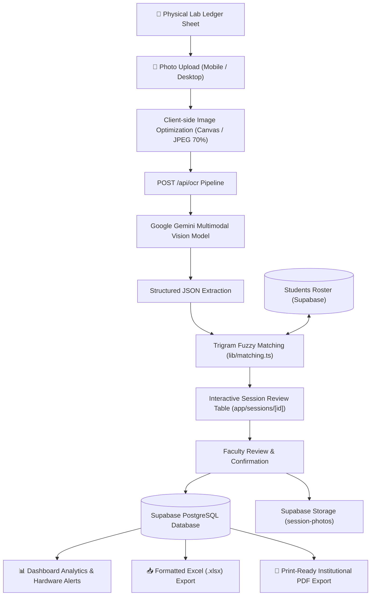

# 🎓 VIMTECH Computer Lab Ledger System

[](https://nextjs.org/)
[](https://react.dev/)
[](https://www.typescriptlang.org/)
[](https://tailwindcss.com/)
[](https://supabase.com/)
[](https://ai.google.dev/)
[](https://vercel.com/)

> **Next-generation digital laboratory management system** designed for collegiate computer science & IT departments. Automatically digitizes physical handwritten sign-in ledger sheets using Google Gemini Vision OCR, reconciles records against student rosters via fuzzy trigram matching, tracks hardware incidents, and generates audit-ready institutional reports.

---

## 📑 Table of Contents

- [Overview & The Problem](#-overview--the-problem)
- [Key Features](#-key-features)
- [System Architecture](#-system-architecture)
- [Tech Stack](#-tech-stack)
- [Database Architecture & Schema](#-database-architecture--schema)
- [Project Structure](#-project-structure)
- [Getting Started](#-getting-started)
  - [Prerequisites](#prerequisites)
  - [Installation](#installation)
  - [Database Setup](#database-setup)
  - [Running Locally](#running-locally)
- [Environment Variables](#-environment-variables)
- [Vercel Deployment](#-vercel-deployment)
- [Security & Compliance](#-security--compliance)
- [Author & Acknowledgements](#-author--acknowledgements)

---

## 🔍 Overview & The Problem

In college computing laboratories, hundreds of students log in daily across multiple shifts and sections. Institutional compliance (NAAC, NBA, and university inspections) mandates recording student names, university roll numbers (UUCMS), assigned terminal numbers, peripheral health, signatures, and faculty sign-offs.

Historically, this is tracked in **physical paper logbooks**:
- **Manual Data Entry Burden**: Lab assistants spend hours transcribing paper logs into spreadsheets.
- **Human Error & Illegible Handwriting**: Messy handwriting leads to corrupted roll numbers and unverified attendance.
- **Hardware Black Holes**: Mouse, keyboard, or display faults noted in margins are rarely aggregated into timely maintenance tickets.
- **Audit Stress**: Compiling term-end compliance reports takes days of manual paper retrieval.

**VIMTECH Lab Ledger** solves this by bridging the physical and digital divide: faculty snap a smartphone photo of the paper ledger sheet, and AI extracts, verifies, aggregates, and archives the entire session in seconds.

---

## ✨ Key Features

### 📸 1. Multimodal AI Ledger Digitization (Gemini OCR)
- Snap photos of multi-page paper ledger sheets directly from mobile or desktop.
- High-resolution in-browser canvas downscaling for ultra-fast, low-bandwidth uploads.
- Multimodal extraction capturing:
  - Header: Date, Section, Class, Faculty Name, System Count, Peripheral Counts (Mouse, Keyboard).
  - Row Data: Serial number, Student Name, UUCMS number, System allocation, Signature detection, and Remarks.
- Resilient multi-tier model fallback pipeline (`gemini-2.5-flash`, `gemini-flash-latest`, `gemini-3.6-flash`, `gemini-2.5-pro`).

### 👥 2. Student Roster Management & Trigram Matching
- Centralized student roster directory with section tagging.
- Batch import via **CSV or Excel (`.xlsx`/`.xls`)** with automatic column header detection.
- Single student manual creation modal with instant validation.
- **Fuzzy Trigram Matching Algorithm**: Automatically matches distorted or abbreviated handwritten names and roll numbers against enrolled students with confidence scoring.

### 📝 3. Interactive Review & Data Grid
- Interactive tabular review grid loaded immediately post-extraction.
- In-place cell editing for student names, UUCMS numbers, system IDs, and remarks.
- Add or delete entries with zero desynchronization.
- One-click **Faculty Confirmation** locking records into verified state.

### 📊 4. Analytical Intelligence Dashboard
- **Hardware Defect Tracker**: Automatically aggregates repeated system issues into flagged maintenance alerts (e.g. "System #4: 3 mouse disconnect complaints").
- **Signature Compliance Gauge**: Audits verified student physical signatures vs. absent entries.
- **Section Turnout & Lab Utilization**: Visual breakdown of attendance and shift distribution.
- **Student Lab History Lookup**: Instant audit trail of every session attended and workstation utilized by an individual student.

### 📥 5. Institutional Export Engine
- **Formatted Excel Spreadsheets**: Custom `.xlsx` exports with official headers, column structures, and totals (fully sanitized against CWE-1236 Formula Injection).
- **Print-Ready PDF Reports**: High-definition PDF generation with college crest, tabular layout, and faculty signature blocks ready for inspection portfolios.

### 📱 6. Progressive Web App (PWA)
- Full-screen mobile application experience installable on Android and iOS devices.
- Offline static caching powered by custom Service Worker (`/sw.js`).
- Local network binding (`-H 0.0.0.0`) enabling seamless access across college Wi-Fi.

---

## 🏛 System Architecture



---

## 🛠 Tech Stack

| Layer | Technology | Purpose |
|---|---|---|
| **Framework** | [Next.js 15.3.3](https://nextjs.org/) (App Router) | Fullstack React framework with Server Components & Edge routing |
| **UI Library** | [React 19.1.0](https://react.dev/) | Core component lifecycle & reactive state management |
| **Language** | [TypeScript 5.8.3](https://www.typescriptlang.org/) | End-to-end static typing across DB schemas, API routes, and components |
| **Styling** | [Tailwind CSS 3.4.17](https://tailwindcss.com/) | Responsive institutional UI, custom brand palette, utility-first design |
| **Database** | [Supabase PostgreSQL](https://supabase.com/) | Cloud database with Row-Level Security, pg_trgm extensions, and storage |
| **AI Vision** | [Google Gemini REST API](https://ai.google.dev/) | Multimodal handwriting OCR extraction from ledger photos |
| **File Parsing** | [PapaParse](https://www.papaparse.com/) & [XLSX (SheetJS)](https://sheetjs.com/) | In-browser CSV and Excel roster parsing and formatted exports |
| **PDF Generation**| [@react-pdf/renderer](https://react-pdf.org/) | High-fidelity institutional PDF generation with embedded branding |
| **Icons & Alerts**| [Lucide React](https://lucide.dev/) & [Sonner](https://sonner.emilkowal.ski/) | Modern icon library and interactive notification toasts |
| **Deployment** | [Vercel](https://vercel.com/) | Global edge serverless hosting with automated CI/CD pipeline |

---

## 🗄 Database Architecture & Schema

The database runs on PostgreSQL (Supabase) equipped with the `pg_trgm` extension for high-performance fuzzy text matching.

### Core Tables

#### 1. `students`
Stores the institutional student directory for automated attendance matching.
```sql
create table students (
  id           uuid primary key default gen_random_uuid(),
  name         text not null,
  ucms_no      text unique not null,
  section      text,
  created_at   timestamptz default now()
);
```

#### 2. `lab_sessions`
Captures metadata for each lab class or shift.
```sql
create table lab_sessions (
  id                    uuid primary key default gen_random_uuid(),
  session_date          date not null,
  section               text,
  class_name            text,
  faculty_name          text,
  total_system_count    int,
  total_mouse_count     int,
  total_keyboard_count  int,
  faculty_confirmed     boolean default false,
  remarks               text,
  created_at            timestamptz default now()
);
```

#### 3. `lab_entries`
Records individual student check-ins per session.
```sql
create table lab_entries (
  id                 uuid primary key default gen_random_uuid(),
  session_id         uuid references lab_sessions(id) on delete cascade,
  sl_no              int,
  raw_name_ocr       text,
  raw_ucms_ocr       text,
  student_id         uuid references students(id),
  system_no          text,
  signature_present  boolean default false,
  signature_crop_url text,
  ocr_confidence     numeric,
  matched            boolean default false,
  remarks            text,
  created_at         timestamptz default now()
);
```

#### 4. `session_photos`
Stores links to physical ledger page photographs uploaded to Supabase Storage.
```sql
create table session_photos (
  id           uuid primary key default gen_random_uuid(),
  session_id   uuid references lab_sessions(id) on delete cascade,
  photo_url    text not null,
  page_number  int default 1,
  archived     boolean default false,
  created_at   timestamptz default now()
);
```

---

## 📂 Project Structure

```
clg-led-web/
├── app/
│   ├── api/
│   │   ├── auth/
│   │   │   ├── login/route.ts      # Authentication handler with session cookie
│   │   │   └── logout/route.ts     # Session termination handler
│   │   ├── backup/route.ts         # Automated Excel archival endpoint
│   │   └── ocr/route.ts            # Multimodal Gemini OCR & fuzzy matching pipeline
│   ├── dashboard/
│   │   └── page.tsx                # Hardware alerts, analytics & student history
│   ├── export/
│   │   └── page.tsx                # Filtered multi-session PDF & Excel export page
│   ├── login/
│   │   └── page.tsx                # Sign-in portal with PWA installation prompt
│   ├── roster/
│   │   └── page.tsx                # Student roster directory, search & batch upload
│   ├── sessions/
│   │   ├── [id]/page.tsx           # Interactive review table & confirmation
│   │   ├── new/page.tsx            # Session creation (Photo OCR / Manual Entry)
│   │   └── page.tsx                # Chronological list of recorded sessions
│   ├── globals.css                 # Global styles & Tailwind utilities
│   ├── layout.tsx                  # Root layout with Navbar & Sonner toast provider
│   └── page.tsx                    # Landing / Hero introduction page
├── components/
│   ├── Navbar.tsx                  # Responsive navigation bar with active route indicators
│   ├── PhotoUpload.tsx             # Multi-photo upload with drag-and-drop & ordering
│   ├── RosterUpload.tsx            # CSV/XLSX file parser & batch database upsert
│   └── SessionTable.tsx            # Live editable table grid with auto-calculation
├── lib/
│   ├── export-excel.ts             # Formatted spreadsheet generation with formula sanitization
│   ├── export-pdf.tsx              # Institutional PDF document generator (react-pdf)
│   ├── gemini.ts                   # Gemini Vision API client with model fallbacks
│   ├── matching.ts                 # Trigram fuzzy similarity student reconciliation engine
│   ├── supabase.ts                 # Browser & Server Supabase client factories
│   └── types.ts                    # Universal TypeScript data interfaces
├── public/
│   ├── logo.png                    # Institutional branding crest
│   ├── manifest.json               # Web App Manifest for mobile PWA install
│   └── sw.js                       # Service Worker for offline static asset caching
├── supabase/
│   ├── schema.sql                  # Primary PostgreSQL tables & indexes
│   ├── schema-v2.sql               # Analytical SQL functions (flagged systems, history)
│   └── rls-policies.sql            # Hardened Row-Level Security policies
├── middleware.ts                   # Route guard middleware protecting faculty surfaces
├── next.config.js                  # Next.js optimization & allowed origins config
├── tailwind.config.ts              # Tailwind CSS theme configuration
├── tsconfig.json                   # TypeScript compiler options
└── package.json                    # Project dependencies & scripts
```

---

## 🚀 Getting Started

### Prerequisites
- **Node.js**: v18.0.0 or later (v20+ recommended)
- **Package Manager**: `npm` (or `pnpm` / `yarn`)
- **Supabase Account**: A free Supabase PostgreSQL project
- **Google AI Studio Key**: A free Gemini API Key from [Google AI Studio](https://aistudio.google.com/)

### Installation

1. **Clone the repository**:
   ```bash
   git clone https://github.com/Mohitgujjar07/vimtech-led-web.git
   cd vimtech-led-web
   ```

2. **Install dependencies**:
   ```bash
   npm install
   ```

3. **Configure Environment Variables**:
   Create a `.env.local` file in the project root (see [Environment Variables](#-environment-variables)).

### Database Setup

1. Open your **Supabase Dashboard** -> **SQL Editor**.
2. Run `supabase/schema.sql` to initialize extensions and tables.
3. Run `supabase/schema-v2.sql` to initialize stored reporting functions.
4. Run `supabase/rls-policies.sql` to apply access control rules.
5. In **Storage**, create a public bucket named `session-photos` for ledger image uploads.

### Running Locally

Start the local development server bound to all local network interfaces:
```bash
npm run dev
```

- **Local Machine**: Open [http://localhost:3000](http://localhost:3000)
- **Mobile Devices (Same Wi-Fi)**: Open `http://<YOUR_LOCAL_IP>:3000` (e.g. `http://192.168.0.95:3000`)

---

## 🔑 Environment Variables

Create `.env.local` in your root directory with the following variables:

```env
# Supabase Configuration
NEXT_PUBLIC_SUPABASE_URL=https://<your-project-ref>.supabase.co
NEXT_PUBLIC_SUPABASE_ANON_KEY=eyJhbGciOi...
SUPABASE_SERVICE_ROLE_KEY=eyJhbGciOi...

# Google Gemini AI Key
GEMINI_API_KEY=AIzaSy...

# Faculty Administrative Login Credentials
LAB_ADMIN_USERNAME=admin
LAB_ADMIN_PASSWORD=admin123

# Optional: Vercel Cron Secret for Automated Backups
CRON_SECRET=
```

---

## 🌐 Vercel Deployment

Deploying with Vercel gives you instant global hosting with automatic SSL and continuous deployment:

1. Push your repository to GitHub.
2. In [Vercel Dashboard](https://vercel.com/dashboard), click **"Add New..."** → **"Project"**.
3. Import `Mohitgujjar07/vimtech-led-web`.
4. In **Settings → Environment Variables**, add the 6 keys listed in the [Environment Variables](#-environment-variables) section.
5. Click **Deploy**.

Any subsequent push to the `main` branch will automatically trigger an optimized production build.

---

## 🛡️ Security & Compliance

- **CWE-1236 Formula Injection Immunity**: Excel exports sanitize leading `=`, `+`, `-`, and `@` characters to prevent remote formula code execution in administrative spreadsheets.
- **Strict Edge Middleware**: Sensitive routes (`/sessions`, `/roster`, `/dashboard`, `/export`) are guarded by Next.js edge middleware requiring verified faculty session cookies.
- **Quota Safeguards**: The OCR endpoint strictly enforces authentication, payload size caps, and image compression to prevent Google Gemini API quota starvation.
- **Row-Level Security (RLS)**: Database tables enforce PostgreSQL RLS policies ensuring secure segregation between browser client queries and server-side service role operations.

---

## 👨‍💻 Author & Acknowledgements

Developed for **Vaisiri Institute of Management & Technology (VIMTECH)** Computer Science & Laboratory Operations.

- **Repository**: [https://github.com/Mohitgujjar07/vimtech-led-web](https://github.com/Mohitgujjar07/vimtech-led-web)
- **Maintained by**: [Mohit Gujjar](https://github.com/Mohitgujjar07)

---

<div align="center">
  <sub>Built with ❤️ for modern college laboratory digitization.</sub>
</div>
